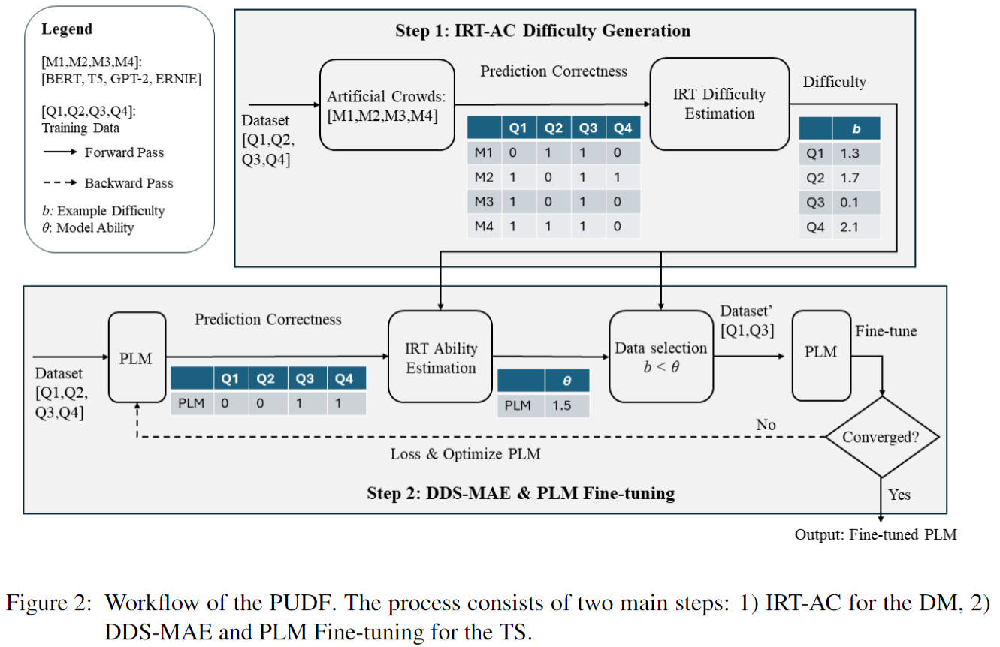
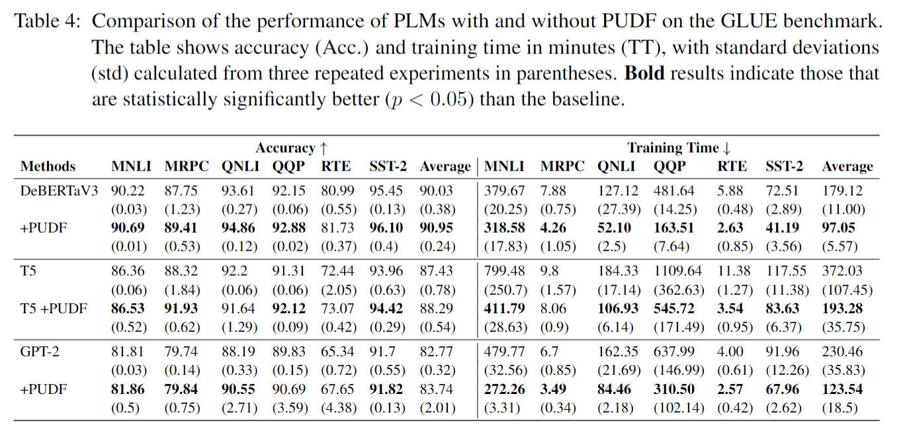
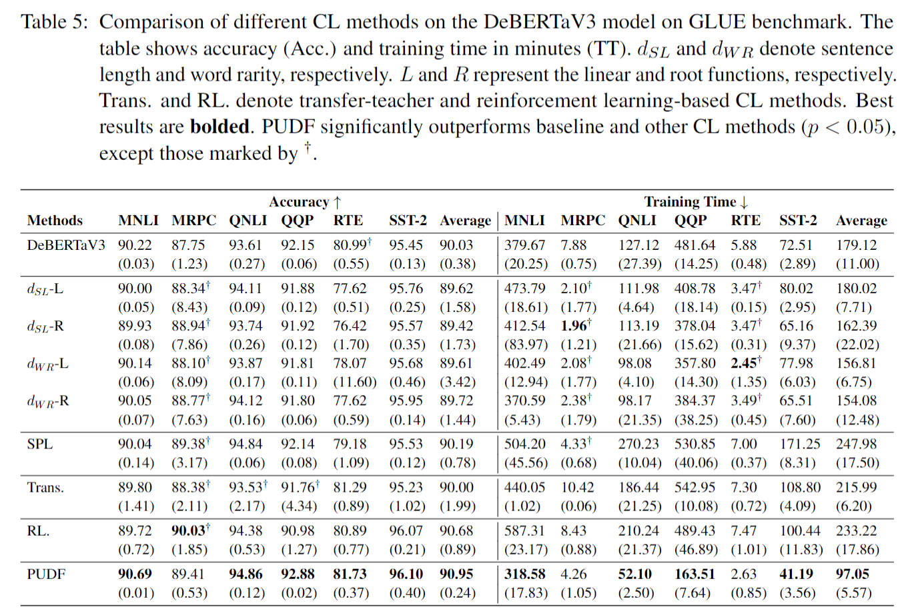

# PUDF for Curriculum Learning

This repository contains the implementation of the Psychology-based Unified Dynamic Framework (PUDF) for Curriculum Learning, as presented in our paper titled *"A Psychology-based Unified Dynamic Framework for Curriculum Learning."*

## Table of Contents

1. [Introduction](#introduction)
2. [Features](#features)
3. [PUDF Workflow](#pudf-workflow)
4. [Installation](#installation)
5. [Usage](#usage)
   - [Generating Data Difficulty](#generating-data-difficulty)
   - [Running Experiments](#running-experiments)
   - [Benchmarking](#benchmarking)
   - [Ablation Study](#ablation-study)
6. [Results](#results)
7. [Citation](#citation)
8. [License](#license)

## Introduction

The PUDF framework is designed to enhance the performance of machine learning models by dynamically adjusting the training curriculum based on the difficulty of the training data and the model's ability. It leverages Item Response Theory (IRT) and Artificial Crowds (AC) to automatically estimate the difficulty of training examples and the ability of models during the training process.

## Features

- Automatic difficulty estimation for training data
- Dynamic curriculum adjustment during training
- Implementation for GLUE and SuperGLUE benchmarks
- Comparison with state-of-the-art curriculum learning methods
- Ablation study capabilities

## PUDF Workflow

The PUDF framework consists of two main steps:

1. IRT-AC for the Difficulty Measurement (DM)
2. DDS-MAE and PLM Fine-tuning for the Training Strategy (TS)




## Installation

1. Clone the repository:

   ```
   git clone git@github.com:nd-ball/cl-irt.git
   cd cl-irt
   ```

2. Install the required dependencies:

   ```
   pip install -r requirements.txt
   ```

## Usage

### Generating Data Difficulty

Before running the experiments, generate the difficulty scores for the training data:

```bash
cd gen_difficulty
bash gen_respon_256.sh
```

This step generates difficulty scores for the training dataset using IRT-AC.

### Running Experiments

#### Baseline Models

To run baseline experiments:
```bash
cd baseline_GLUE
bash glue_deberta.sh

or
cd baseline_GLUE
bash glue_gpt2.sh

or
cd baseline_GLUE
bash glue_t5.sh

Similarly,
cd ../baseline_SuperGLUE
bash superglue_deberta.sh
```

#### Baseline+PUDF Models

To run PUDF-enhanced models:

```bash
cd PUDF_GLUE
bash glue_PUDF_debertav3.sh

cd PUDF_Super_GLUE
bash superglue_debertaV3.sh
```

### Benchmarking

To compare PUDF with other state-of-the-art curriculum learning methods:

```bash
cd benchmark_CL_GLUE
```

### Ablation Study

To perform an ablation study and analyze the contributions of different components of PUDF:

```bash
cd ablation_study
```

## Results

Our experiments show that PUDF significantly improves the performance of various pre-trained language models (PLMs) on the GLUE benchmark. Here are some key results:

### Performance Comparison on GLUE Benchmark




### Comparison with Other Curriculum Learning Methods




These results demonstrate that PUDF consistently improves both the accuracy and training efficiency of various PLMs across different GLUE tasks.

## Citation

If you use this framework in your research, please cite our paper:

```

@misc{2408.05326,
Author = {Guangyu Meng and Qingkai Zeng and John P. Lalor and Hong Yu},
Title = {A Psychology-based Unified Dynamic Framework for Curriculum Learning},
Year = {2024},
Eprint = {arXiv:2408.05326},
}

```

## License

This project is licensed under the MIT License. See the [LICENSE](LICENSE) file for details.
